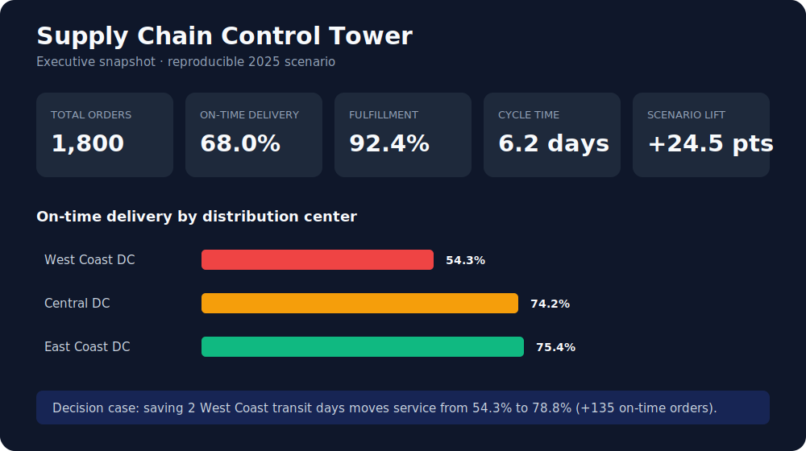

# Supply Chain Control Tower

An end-to-end analytics project that turns fragmented order, supplier, product, warehouse, shipment, and inventory data into operational KPIs and decision-ready reports.

> **Portfolio result:** The reproducible scenario identifies a 68.0% network on-time delivery rate, isolates the weakest distribution center, prioritizes inventory exceptions by margin exposure, and quantifies a service-improvement intervention.



## Business problem

Leadership needs one reliable view of fulfillment performance. Orders are growing, but late deliveries, damage, and transportation costs vary across warehouses and suppliers. This project builds a reproducible control-tower data layer to answer:

- Are customers receiving orders on time?
- Which suppliers and warehouses create the most operational risk?
- Where are shipping costs and cycle times increasing?
- Which products and regions drive revenue and service failures?
- Which exceptions should management address first based on financial exposure?
- How much service improvement could a targeted intervention deliver?

## Solution

```text
Synthetic operational data
        |
        v
Data validation -> SQLite warehouse -> SQL KPI layer -> Dashboard-ready CSVs
                                               \-> Executive HTML/Markdown report
```

The deterministic generator creates a full year of realistic operational data, including intentionally uneven warehouse performance so the analysis reveals actionable patterns.

## Technology

- Python: reproducible data generation, validation, ETL, and exports
- SQL/SQLite: relational model and analytical queries
- Decision support: risk-ranked exception management and scenario analysis
- Power BI/Tableau-ready CSV outputs
- GitHub Actions and `unittest`: automated pipeline and integrity checks

## Data model

```text
suppliers 1---* products 1---* order_lines *---1 orders 1---1 shipments
                                                     *
                                                     |
                                                     1
                                                warehouses
```

## KPIs

- Fulfillment rate
- On-time delivery rate
- Order cycle time
- Shipping cost per order
- Supplier damage rate
- Days of supply and critical inventory exposure
- Purchase value by supplier
- Warehouse and monthly performance trends
- Carrier-lane scorecards and intervention lift
- Estimated gross-margin exposure

## Run locally

Requires Python 3.10 or newer. No third-party packages are required.

```bash
python src/pipeline.py
python src/report.py
python -m unittest discover -s tests -v
```

The pipeline creates:

- `data/control_tower.db`: analytics-ready SQLite database
- `data/raw/`: normalized source CSVs
- `data/processed/order_performance.csv`: order-level dashboard table
- `data/processed/line_detail.csv`: product and revenue dashboard table
- `data/processed/inventory_risk.csv`: SKU-level days-of-supply and risk classification
- `reports/dashboard.html`: portable executive dashboard
- `reports/executive_summary.md`: quantified findings and recommendations

Run the queries in `sql/kpi_queries.sql` against the database or connect Power BI/Tableau to the processed CSV files.

## Repository structure

```text
data/                 Generated locally
sql/schema.sql        Relational warehouse definition
sql/kpi_queries.sql   Executive and operational analysis
src/pipeline.py       Generation, validation, ETL, and export pipeline
src/report.py         Executive analysis and portable HTML report
src/analytics.py      Reusable KPI, exception, and scenario logic
tests/                Automated integrity and KPI tests
reports/              Generated portfolio-ready findings
docs/                 Data dictionary and analytical assumptions
.github/workflows/    Continuous integration
```

## Design decisions and limitations

- Synthetic data avoids publishing confidential company information and makes the project fully reproducible.
- SQLite keeps setup simple; the schema can be migrated to PostgreSQL, BigQuery, or Snowflake.
- The portable HTML report demonstrates the analysis without requiring proprietary BI software; the processed tables remain ready for Power BI or Tableau.
- The intervention scenario is a transparent what-if estimate; it supports prioritization but does not claim causal impact.

## Portfolio takeaway

This project demonstrates the ability to translate a supply-chain problem into a relational model, validate operational data, calculate service and cost KPIs, and prepare trusted outputs for executive reporting.
